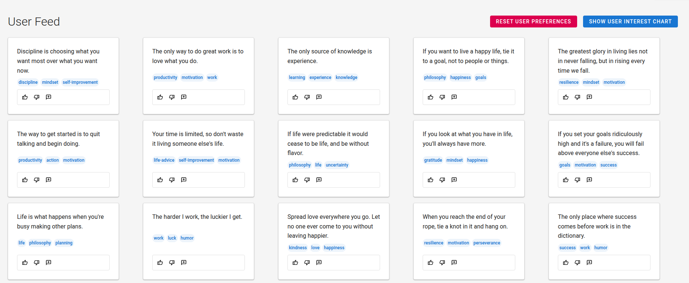
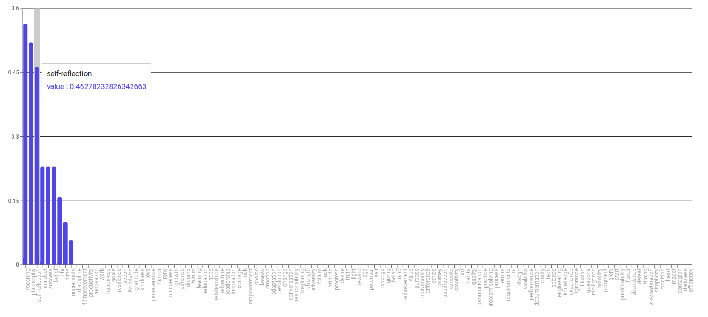

# VectorFeed

A simple experimental recommendation system based on user interactions and tag-weight vectors.

**Live Demo:**
[https://vector-feed.vercel.app/](https://vector-feed.vercel.app/)

---

## Overview

VectorFeed is a minimal implementation of a feed ranking system.

Each user is represented by a vector of tag preferences.
Each interaction (like, click, dislike, comment) updates this vector.
Content is then ranked based on how well it matches the user profile.

The goal is not production quality, but understanding how recommendation systems work at a fundamental level.

---

## How it works

### 1. Feature Space

All tags define a shared feature space:

```text
["fitness", "mindset", "humor", "tech", ...]
```

Each user has a weight for every tag.

---

### 2. User Vector

Example:

```text
fitness: 0.8
mindset: 0.3
humor: 0.1
```

The vector is updated based on interactions and normalized to keep values stable.

---

### 3. Scoring

Each card has tags:

```text
["fitness", "discipline"]
```

Score is computed as:

```text
average(user[tag] for tag in card.tags)
```

This avoids bias toward cards with many tags.

---

### 4. Exploration

The system injects cards with tags the user rarely interacts with.

This prevents the feed from becoming too narrow and helps discover new interests.

---

## Screenshots

### Feed



---

### User Preference Chart



---

## Tech Stack

* React
* Recharts
* LocalStorage (for persistence)
* No backend

---

## Project Structure

```text
src/
  components/     UI (Feed, Card, Chart)
  engine/         Core logic (scoring, update, decay, exploration)
  hooks/          useFeed (state + logic orchestration)
  data/           Static card dataset
  config/         Tags / feature space
```

---

## Limitations

* No real machine learning (rule-based system)
* No embeddings
* No collaborative filtering
* Static dataset
* Client-side only

---

## Why this project exists

To understand:

* how recommendation systems work
* how user behavior translates into signals
* how ranking and exploration interact

---

## Possible Improvements

* cosine similarity instead of simple averaging
* time-based decay per tag
* better exploration strategy (epsilon-greedy / UCB)
* persistent backend
* real user data

---

## Run locally

```bash
npm install
npm start
```
